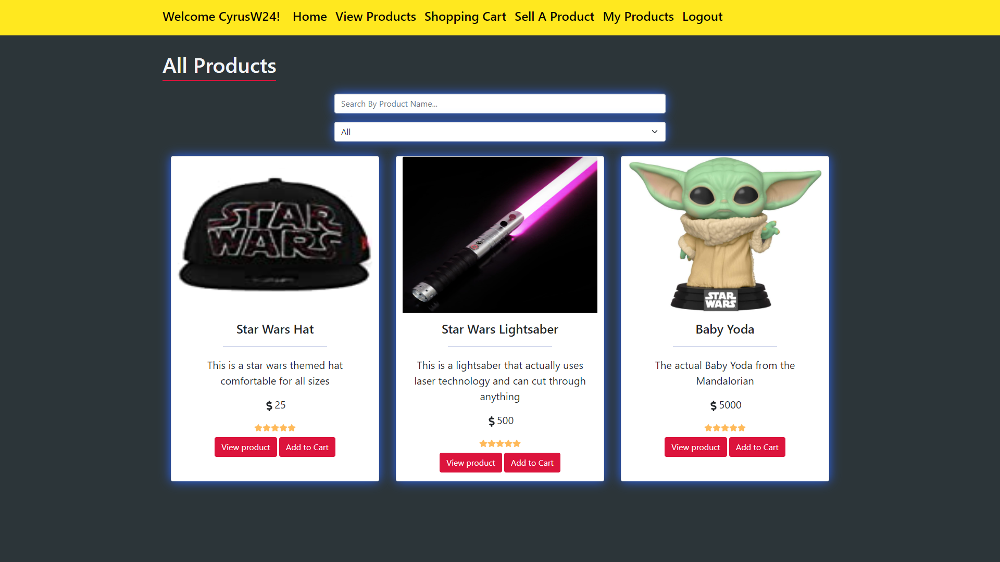
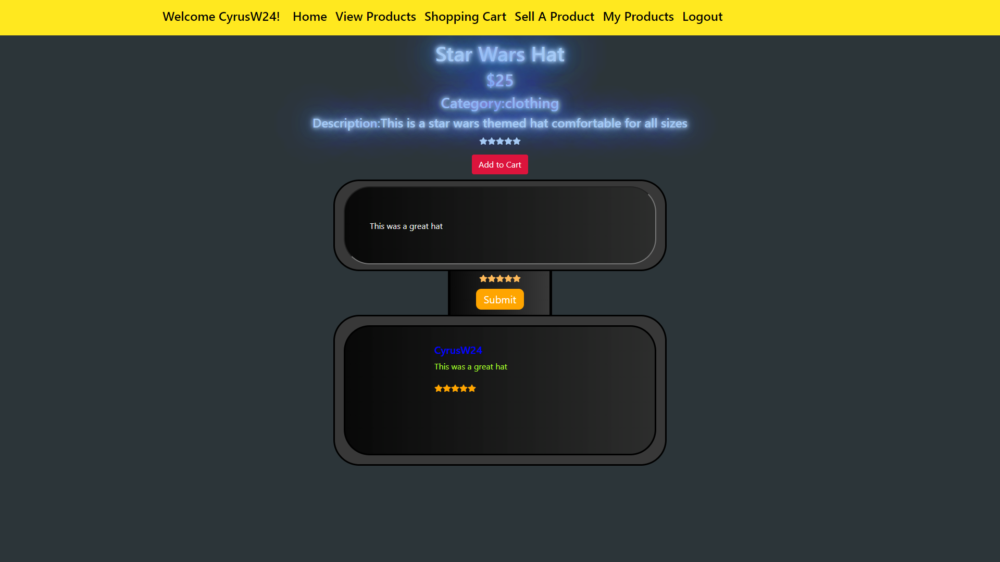
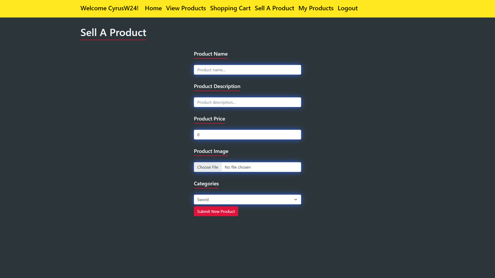
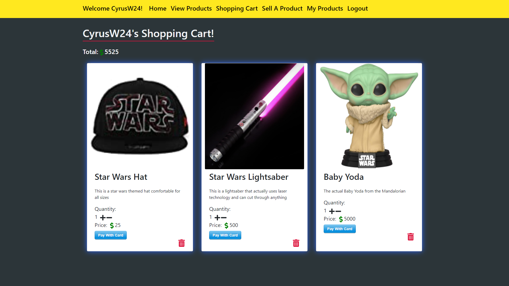
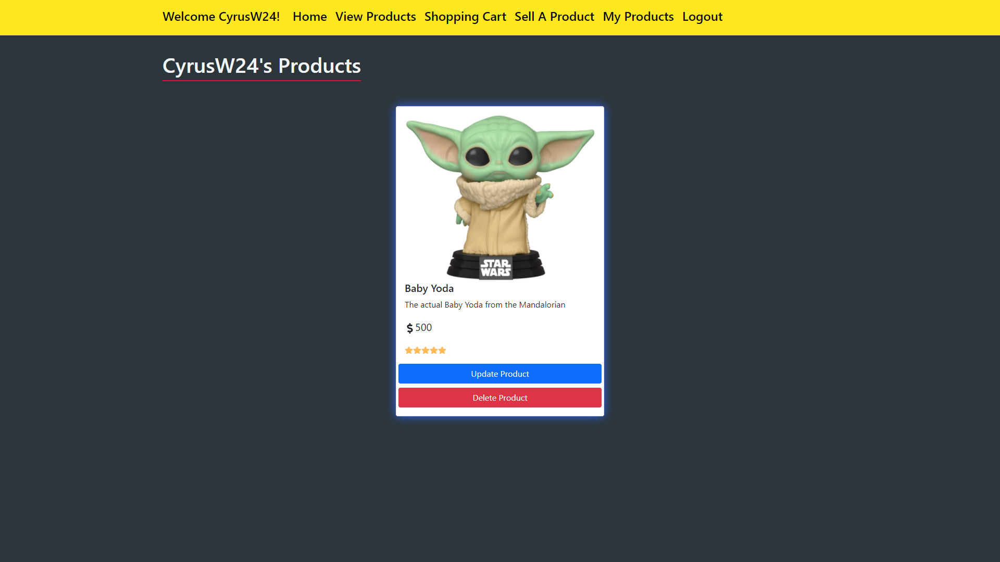

This application was built by Carter Willey, Zachary Wright, Andy Wade and Cyrus Warner as part of our group capstone project.

-The application was built using React for the front-end and ASP.NET Core for the back-end. We built our own api in ASP.NET Core and tested our endpoints in postman before starting on building our React front-end.

-The application enables a user to do almost any action any other ecommerce website does, but our ecommerce website is Star Wars themed. For any Star Wars fans looking for product our application is a great place to go looking for the products anyone desires.

-The all products page of the site features all of the products being sold on the website, a search by product name and a categories search to find specific products. Users can also immediately add that item to that cart if they would like or view the product to see reviews or write a review.

-The sell product page consists of a form that allows users to create a product and add an image for their product. If a user wouldnt like an image for their product they can submit their product without an image and a generic No Image card will show instead of an image with all the product details below.

-The shopping cart page displays all of a users products, the quantity of the products, the total of all of the products, the price and a button for if a user wants to complete their purchase in their shopping cart.

-The my products page displays all of a users products that they are personally selling. The my products page has CRUD functionality for a user to update their product information, product image or remove the product from the marketplace.

